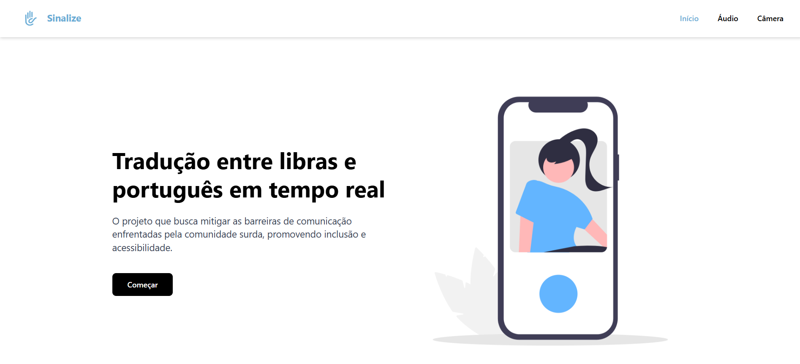
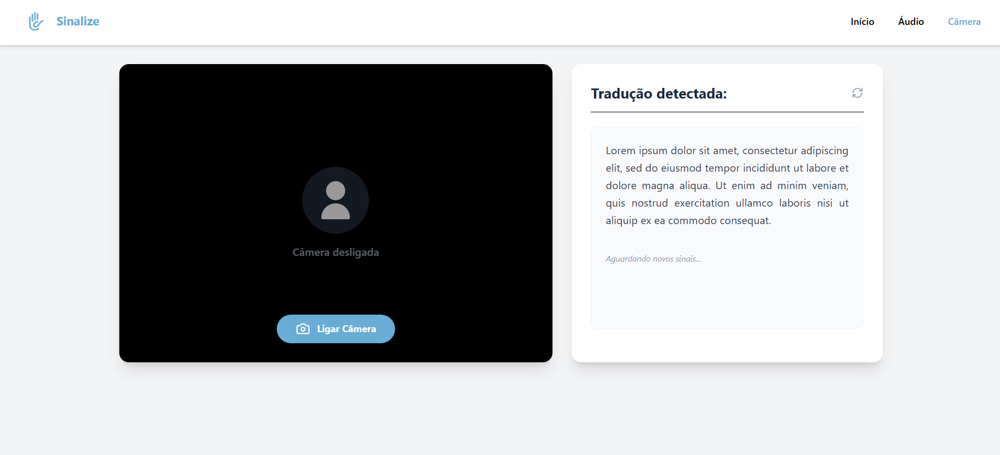

## 📖 Projeto Sinalize

**`O que é?`**

Sinalize é uma plataforma web que realiza a tradução bidirecional entre a Língua Brasileira de Sinais (Libras) e o Português em tempo real por meio de visão computacional, inteligência artificial representações visuais animadas.

**`Problemática`**

A falta de fluência em Libras pela maioria dos ouvintes cria uma lacuna comunicacional que resulta em exclusão social, digital e profissional para a comunidade surda. Essa barreira limita a autonomia dos indivíduos e dificulta o acesso a serviços básicos e ambientes educacionais, ferindo direitos assegurados por leis de inclusão (Lei nº 10.436/2002 e Lei nº 13.146/2015).

**`Solução`**

A solução proposta é uma ferramenta de tradução simultânea que promove a interatividade direta entre surdos e ouvintes em diversos contextos. Desenvolvido com JavaScript, Python e infraestrutura Firebase, o projeto foca na inclusão digital e na democratização da comunicação, oferecendo uma interface intuitiva que permite tanto a leitura de gestos quanto a visualização de sinais por meio de um avatar, garantindo maior independência ao usuário.

#

#

### 💻 Interface

**`Inicio`**

A página inicial foi projetada para ser o ponto central de navegação, apresentando uma interface limpa com orientação responsiva. O design utiliza tons de azul e branco, escolhidos propositalmente para transmitir confiança, serenidade e clareza visual, evitando distrações e facilitando o foco do usuário surdo ou ouvinte nas opções de tradução.

**`Tradução por Áudio (Português → Libras)`**

Nesta tela, o usuário pode digitar ou utilizar o microfone para inserir frases em Português. A interface é dividida entre o campo de entrada e a visualização 3D, onde um avatar animado realiza a sinalização em Libras. O contraste entre o fundo claro e os componentes destacados garante que as sugestões de uso (como "Oi?" e "Bom dia!") sejam facilmente identificáveis.

**`Tradução por Câmera (Libras → Português)`**

Esta interface foca na visão computacional, apresentando o feed da webcam ao lado de um painel de "Tradução Detectada". O uso de bordas arredondadas e cards flutuantes segue tendências modernas de UI, focando em uma experiência de uso intuitiva e profissional, essencial para ambientes educacionais e de atendimento.

#

#

### 📊 Como baixar

Clone o projeto em um arquivo 
<pre>git clone https://github.com/Alexandrediasss/Sinalize-Frontend.git</pre>

Acesse a pasta
<pre>cd Sinalize-Frontend</pre>

Baixe as dependências
<pre>npm install</pre>

Execute o arquivo principal
<pre>npm run dev</pre>

#

### 👨‍💻Nota do desenvolvedor

Muito obrigado pelo interesso no projeto. Fico feliz em poder adquirir mais conhecimentos de programação que irão me ajudar a construir a minha carreira e este projeto é só uma pequena parte do que eu posso codificar.

#